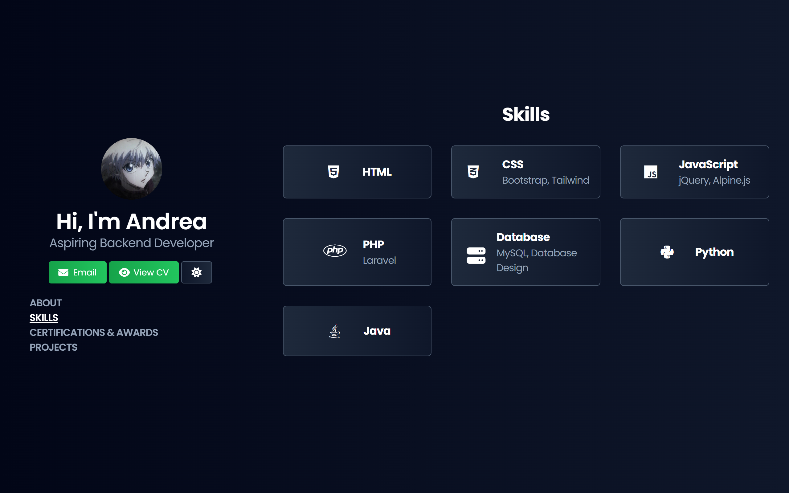
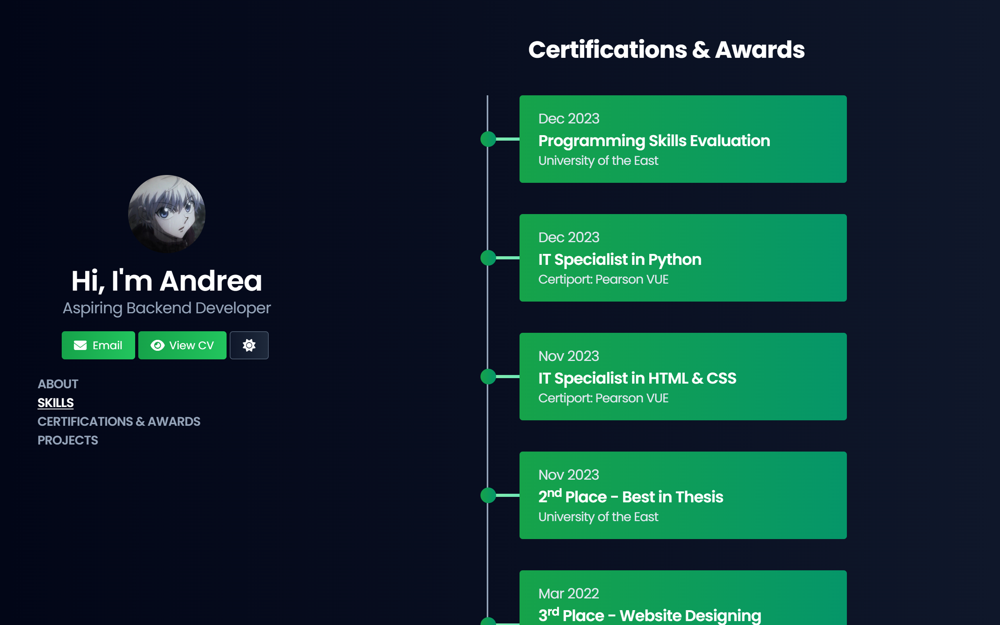

# andimags 2.0

My second personal website developed with HTML, CSS, jQuery, and Tailwind. Featuring both day and dark modes for a personalized browsing experience.

## Screenshots

## Demo

https://andimags.github.io/andimags2/

## 🚀 About Me
Backend developer with an IT degree, proficient in PHP (Laravel), CSS (Bootstrap), and JavaScript. Expert in API integration and database management, showcasing strong problem-solving skills. Passionate about continuous learning and adaptable to emerging technologies. Let's code the future! 🚀💻

